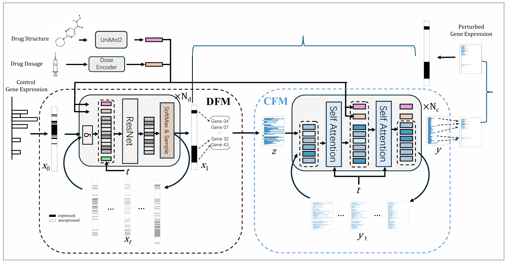

# Train sc2Flow and Baseline Models

*Note: This is first demo version. In the future we will optimize this project.*




## Datasets Download
All data can be downloaded using pertpy.
```python
pertpy.data.srivatsan_2020_sciplex3()
pertpy.data.zhao_2021()
pertpy.data.mcfarland_2020()
```
## Preprocessing
You need to preprocess your dataset to fit each model (e.g. obs_keys rename, drug embedding, data splits). 
We suggest running `preprocess/transfer_tools.py` to do this.

## sc2Flow
The program will train/test all data and splits included in the dataset list.

**Example:**
```python
for dataset_name in [
    'mcfarland',
    'sciplex'
]:
```

### Train
- **DFM**: Run `train.py`
- **CFM**: Run `main.py`

### Test
- **DFM**: Tested while training
- **CFM**: Run `main.py` (set `--evaluate_only True`)

### 2-Stage Inference
1. **Step 1: DFM** - Run `inference_full.py`
2. **Step 2: CFM** - Run `main.py` (set `--DFM_output_path` to the output path from `DFM/inference_full`)

## CellFlow
### Environment
```bash
pip install cellflow-tools
```

### Train
Run `train_sciplex.py`

### Test
Run `validation.py`

## biolord
### Environment
```bash
pip install biolord
```

### Train
Each dataset has its own train script (e.g., `train_sciplex.py`)

### Test
Set `Train = False` while running `train_sciplex.py`

## ChemCPA
### Environment
See [ChemCPA GitHub](https://github.com/theislab/chemCPA)

### Train
For example, run `train_hydra.py` (you have to set `dataset_name` and split name manually)

### Test
Run `predict.py` (set `dataset_name` and split name manually)
